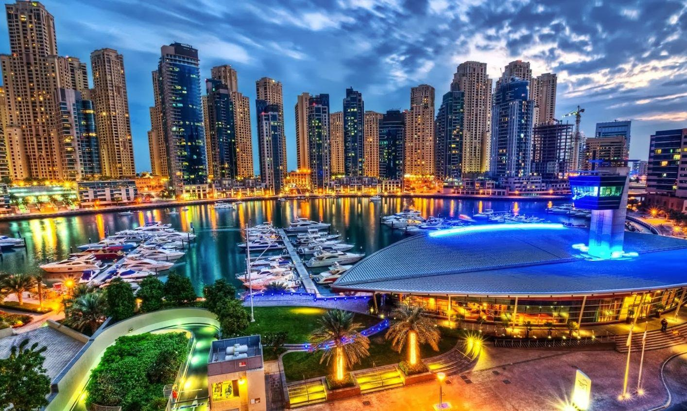
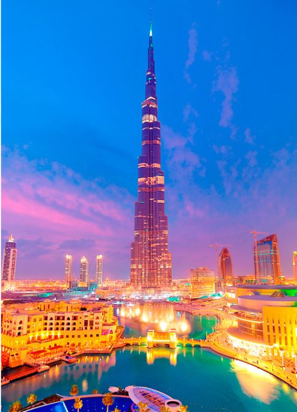

<html>
<head>

</head>
<body>

<ul>
  <li><a href="things.html">Places To Visit</a></li>
  <li><a href="plan you.html">Plan your trip</a></li>
  <li><a href="cal.html">Event Calendar</a></li>
  <li style="float:right"><a class="active" href="about.html">About Bon Voyage</a></li>
</ul>

<!--  Banner Starts  -->

	

		

		
		
		
               
		

	

 <table><tr><h1 align="center"style="color:#b30047;">Best Places To Visit</h1></tr></table>

<table width=100% height=100% cellpadding="20px">
<tr>
<td><h1 style="color:#b30047;">Exotic Paris</h1>
<iframe width="300" height="320" src="https://www.youtube.com/embed/q19D-lU44rI" title="YouTube video player" ></iframe>
</td>

<td ><h1 style="color:#b30047;">Enchanting Dubai</h1>
<iframe width="300" height="300" src="https://www.youtube.com/embed/5cUCxVr7xiw" title="YouTube video player"></iframe>
</td>
<td><h1 style="color:#b30047;">Elegant London</h1>
<iframe width="300" height="300" src="https://www.youtube.com/embed/KuBXNJG2c_I" title="YouTube video player" allowfullscreen></iframe>
</td>
<td><h1 style="color:#b30047;">Pretty Switzerland</h1>
<iframe width="300" height="300" src="https://www.youtube.com/embed/lZomNWn-R7E" title="YouTube video player" allowfullscreen></iframe>
</td>
</tr>

</table>

</body>
</html>
